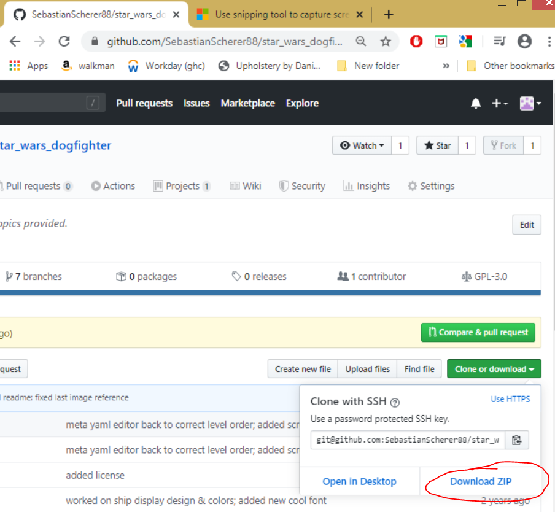

# Star Wars Dogfighter

Welcome to `Star Wars Dogfighter`! 

Please read below for a short game description, how to run the demo version and player controls.

## Summary

This is a game I wanted to do for some time. It's a classic 2D, top-down shooter with where the player shoots down enemy ships while being
supported by ally ships. I had a lot of fun working on this game, and hope you enjoy playing it as much as I enjoyed making it!

Please feel free to try it out on your computer, and contact me at below email to leave some feedback!

scherersebastian@yahoo.de

## Playing the game

Download the game files by selectig the 'Download ZIP files' option on the game's github page:

After extracting the files, run the game by double clicking the file `./build/exe.win-amd64-3.6/star_wars_dogfighter.exe`.

### Game settings

To toggle sound on/off, press the `S` key.

To pause/unpause the game, press the `Esc` key.

To end the game, either

  - click on the "x" in the top right corner of the pygame window.
  - Pressing the `Esc` key, then pressing the Q` key

### Player controls

To accelerate/deccelarate, press the `ARROW UP`/`ARROW DOWN` keys.

To turn left/right, press the `ARROW LEFT`/`ARROW RIGHT` keys.

To fire laser cannons, press the `SPACEBAR`.

To toggle between single/dual/all laser fire modes, press the `F` key.

# May the force be with you!

