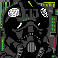

# Star Wars Dogfighter

Welcome to S"tar Wars Dogfighter"! Please read below for a short game description, how to run the demo version and player controls.

## Summary

This is a game I wanted to do for some time. It's a classic 2D, top-down shooter with where the player shoots down enemy ships while being
supported by ally ships. The version in both master and dev_star_wars branches are demo versions that are not the finished game,
but should let you see what its all about. I'm having a lot of fun working on this game, but it still is very much a work in progress!

Please feel free to try it out on your computer, and contact me at below email to leave some feedback!

scherersebastian@yahoo.de

I hope you have as much fun playing (the eventual finished version of) this game as I am having creating it.

## Dependencies

You will need:

- python 3.x
- numpy
- pygame

The untested "./setup" section is still experimental and relies on the player having a working conda installation. I suggest
installing the above dependencies manually.

## Running the game

To run the game, simply open the "./lib/game_class.py" in an editor of your choosing and run the script. It should
create a pygame window and immediately start the game.

Alternativly, you could run "python ./lib/game_class.py" from the windows console - just make sure you are in the
repo's parent directory.

## Running the special editions

If your name is Bridget or Joe, check out your respective branch and run the executable file located at './build/star_wars_dogfighter/sar_wars_dogfighter.exe' either by calling it from the windows console or by double-clicking it.

## Playing the game

The player's ship is starting out on the right side, marked a yellow frame around it. The
aim is to shoot down all hostile ships (marked with red frames), with the support of your
wing-men (marked by green frames).

To toggle sound on/off, press the "S" key.

To pause/unpause the game, press the "Escape" key.

To end the game, click on the "x" in the top right corner of the pygame window.

### Player controls

To accelerate/deccelarate, press the "ARROW UP"/"ARROW DOWN" keys.

To turn left/right, press the "ARROW LEFT"/"ARROW RIGHT" keys.

To fire laser cannons, press the SPACEBAR.

To toggle between single/dual/all laser fire modes, press the "F" key.

